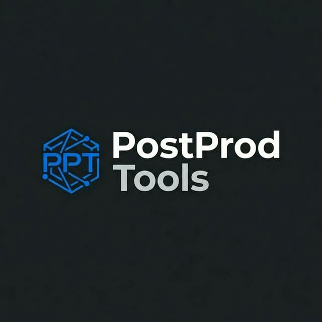
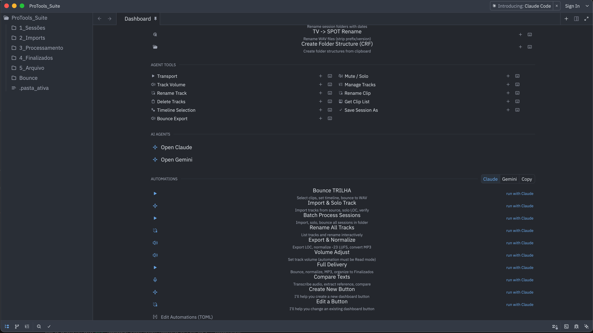
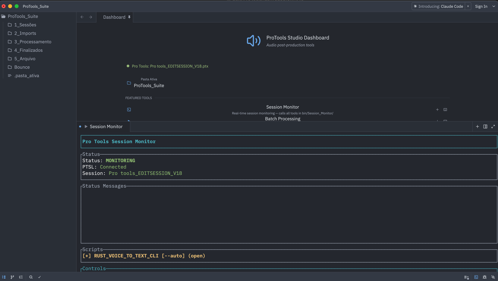
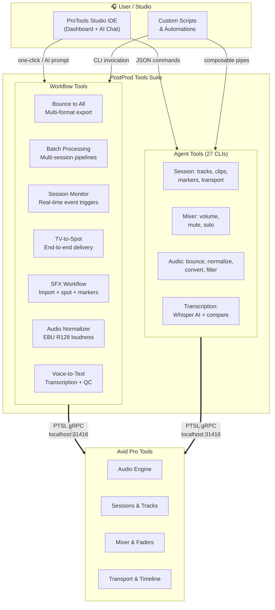

  

  <strong>Workflow automation suite for Pro Tools audio post-production</strong>

  <a href="#workflow-tools">Workflows</a> &middot;
  <a href="#agent-tools">Agent Tools</a> &middot;
  <a href="docs/tool-reference.md">Reference</a> &middot;
  <a href="#how-it-works">How It Works</a> &middot;
  <a href="#licensing">Licensing</a>

---

> **TL;DR:** A bunch of Rust tools that automate the boring parts of Pro Tools — bouncing, batch processing, loudness normalization, session management. You run them, they talk to Pro Tools via gRPC, and the work that used to take hours gets done in minutes.

---

## What is PostProd Tools?

PostProd Tools is a suite of **standalone workflow applications** and **31 composable CLI tools** that automate Pro Tools via the PTSL (Pro Tools Scripting Language) gRPC protocol.

The workflow tools handle complete production pipelines — bounce, batch processing, session monitoring, loudness normalization, voiceover QC — running unattended, start to finish. The agent tools provide granular Pro Tools control for AI-driven automation via the [ProTools Studio IDE](https://github.com/Caio-Ze/protools-studio).

**The result:** workflows that used to take a team of editors hours now run in minutes. One installation replaces the repetitive work of 3–4 full-time operators.

  
   
  ProTools Studio Dashboard — one-click access to all workflow tools and AI automations

  
   
  Session Monitor — real-time Pro Tools session tracking with script automation

## The Problem

Audio post-production studios running Pro Tools face the same bottleneck: highly repetitive, error-prone manual work.

- Bouncing mixes to multiple formats with correct loudness standards
- Processing batches of sessions — importing, consolidating, exporting
- Monitoring session state and triggering scripts in response to changes
- Importing and spotting SFX, voiceover, and music to precise timecodes
- Transcribing audio and comparing against reference scripts for QC
- Versioning and organizing session files across delivery stages

These tasks consume hours of skilled editor time per project. Scaling means hiring more people to do the same repetitive work.

## Workflow Tools

These are the core product — complete, standalone applications that handle entire production pipelines.

### Bounce & Delivery

| Tool | Description |
|------|-------------|
| **Bounce to All** | Configurable multi-format bounce engine. Exports Pro Tools sessions to WAV/MP3/AIFF with format negotiation and delivery folder management |
| **Audio Normalizer** | EBU R128 loudness normalizer with interactive menu. Presets for broadcast (-23 LUFS), internet (-20 LUFS), and peak maximization. Batch processes entire folders |
| **Audio Batch Maximize + MP3** | Interactive batch processor — peak normalizes audio and converts to MP3 in one pass. Preserves folder structure, archives originals |

### Batch Processing

| Tool | Description |
|------|-------------|
| **Batch Processing Orchestrator** | Master workflow controller with fuzzy-select UI. Discovers sessions in a folder, opens them sequentially, and runs processing pipelines across entire project batches |
| **TV-to-Spot Workflow** | End-to-end post-production pipeline: imports source tracks, exports and consolidates, normalizes loudness, and spots clips back — fully automated with multi-phase state machine |
| **SFX Workflow** | Sound effects import pipeline. Maps folder structures to tracks, creates markers from timestamps, imports audio, and spots to timeline. Optional AI metadata extraction |

### Monitoring & QC

| Tool | Description |
|------|-------------|
| **Session Monitor** | Real-time TUI that watches Pro Tools for session changes. Triggers configurable scripts on events (playback state, track modifications). TOML-driven automation rules |
| **Voice-to-Text CLI** | Interactive TUI for voiceover QC. Transcribes session audio via AI, compares against reference scripts, and reports discrepancies. Two-panel interface with auto-detection |

### Import & Spot

| Tool | Description |
|------|-------------|
| **Import & Spot Clips** | Finds newest audio in the LOC folder, imports to clip list, and spots to timeline at the correct timecode (OUT marker + offset). Handles the complete voiceover delivery cycle |
| **WAV/MP3 Converter** | Two-phase batch converter. Handles MP3→WAV and WAV→MP3 (320kbps) with drag-and-drop folder support |

### Utilities

| Tool | Description |
|------|-------------|
| **Session Versioning** | Auto-increments session version numbers (V1→V2→V3) and saves via PTSL |
| **Session Health Check** | Validates Pro Tools has an active session. Quick health check for automation pipelines |
| **Video Optimizer** | Batch converts MP4/MOV/M4V to lightweight proxy files for reference playback |
| **Folder Structure Tools** | Create and rename session folder hierarchies following studio naming conventions |

## Agent Tools

27 granular CLI tools for AI-driven automation. Each performs a single operation and returns structured JSON — designed to be composed by AI agents or scripts.

### Session Management
| Tool | Description |
|------|-------------|
| `agent-manage-tracks` | List, create, hide, inactivate, solo tracks; manage markers; select clips |
| `agent-import-tracks` | Import tracks from a source Pro Tools session |
| `agent-import-trilha` | Import music (TRILHA) tracks from source |
| `agent-rename-track` | Rename a track in the current session |
| `agent-rename-clip` | Rename a clip in the current session |
| `agent-delete-tracks` | Delete one or more tracks |
| `agent-save-session-as` | Save session under a new name or location |
| `agent-get-clip-list` | List all clips in the session |
| `agent-timeline-selection` | Get or set timeline in/out points |
| `agent-transport` | Play, stop, and query transport state |

### Mixer
| Tool | Description |
|------|-------------|
| `agent-mute-solo` | Mute, unmute, solo, or unsolo tracks |
| `agent-track-volume` | Set track fader volume in dB |

### Bounce & Audio
| Tool | Description |
|------|-------------|
| `agent-bounce-export` | Bounce session to WAV or MP3 |
| `agent-bounce-organize` | Move bounced files to a central delivery folder |
| `agent-bounce-normalize-tv` | Two-pass loudness normalization (broadcast-ready) |
| `agent-export-loc` | Export and consolidate a track to WAV |
| `agent-maximize-audio` | Peak-normalize audio |
| `agent-convert-mp3` | Convert audio to MP3 |
| `agent-apply-audio-filter` | Apply FFmpeg audio filter chains |

### Import & Spot
| Tool | Description |
|------|-------------|
| `agent-import-audio` | Import audio files into the clip list |
| `agent-spot-clip` | Spot a clip at a precise sample position |
| `agent-create-markers` | Create markers from a timestamps file |
| `agent-copy-markers` | Copy markers between sessions |
| `agent-version-match` | Find and report versioned tracks |

### Transcription & QC
| Tool | Description |
|------|-------------|
| `agent-transcribe-audio` | Transcribe audio via AI (Groq Whisper) |
| `agent-extract-text` | Extract text from documents |
| `agent-compare-texts` | Compare script against transcription |

## How It Works

**Workflow tools** run complete production pipelines autonomously — bounce an entire session, process a batch of 50 sessions, or monitor Pro Tools and trigger scripts on events.

**Agent tools** are atomic building blocks — each does one thing and returns JSON. They are composed by AI agents, the ProTools Studio dashboard, or custom scripts to build any workflow.

## Deployment

Tools are distributed as **universal macOS binaries** (Apple Silicon + Intel) organized into runtime folders:

| Folder | Contents |
|--------|----------|
| `Bounce/` | Bounce engine, normalizers, format converters, FFmpeg |
| `Session_Monitor/` | Session monitor, import/spot tools, voice-to-text |
| `Batch_Processing/` | Batch orchestrator, TV-to-spot workflow, video optimizer |
| `SFX_Workflow/` | SFX import pipeline, AI metadata extraction |
| `tools/` | Standalone utilities (session check, versioning, folder ops) |

## Requirements

- **macOS 12.0+** (Apple Silicon or Intel)
- **Pro Tools 2025.3+** with PTSL enabled
- Pro Tools running with a session open
- Audio tools require **FFmpeg** (bundled)
- Transcription tools require a **Groq API key**

## Companion: ProTools Studio IDE

PostProd Tools integrates with [**ProTools Studio**](https://github.com/Caio-Ze/protools-studio), a native macOS IDE built on the GPUI framework. The IDE provides:

- A visual dashboard with one-click tool execution
- AI agent integration for natural-language workflow automation
- Real-time session monitoring and track visualization

## Licensing

PostProd Tools is **proprietary commercial software**. All tools are distributed as compiled binaries under a commercial license.

For licensing inquiries, pricing, and demo access:

**Email:** [caioraphael@me.com](mailto:caioraphael@me.com)
**GitHub:** [@Caio-Ze](https://github.com/Caio-Ze)

---

  Built with Rust. Powered by the PTSL protocol. Designed for audio professionals.

