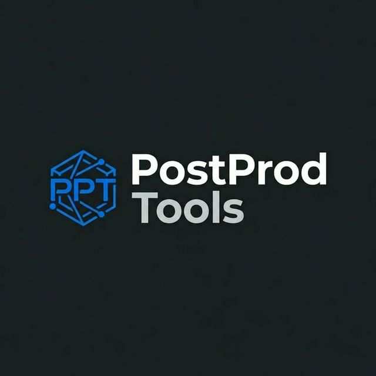
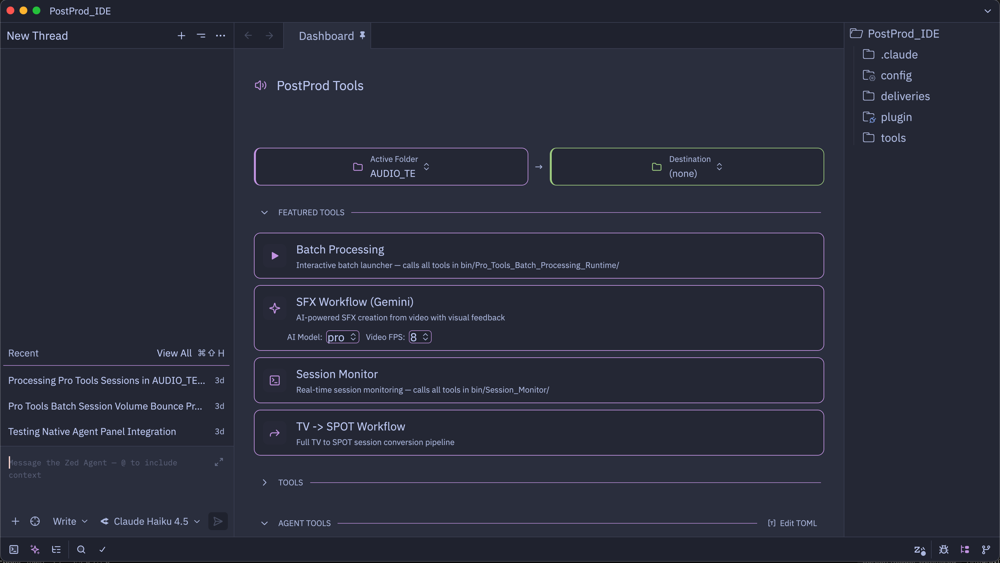
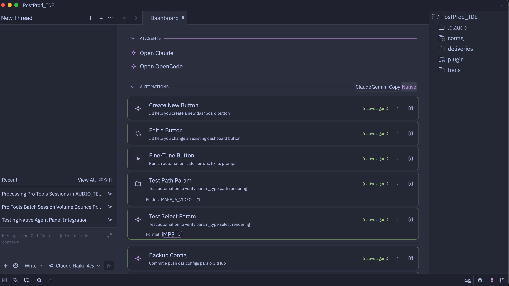
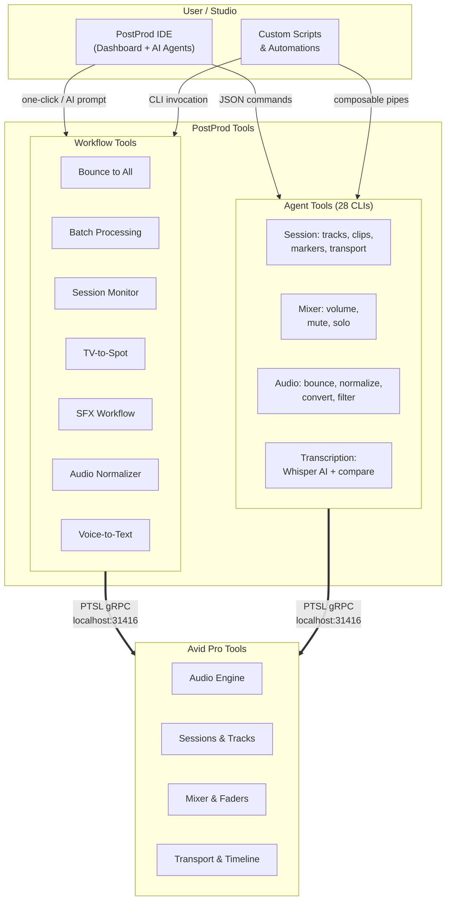

  

  <strong>Pro Tools automation — bouncing, batch processing, loudness normalization, session monitoring</strong>

  <a href="#workflow-tools">Workflows</a> &middot;
  <a href="#agent-tools">Agent Tools</a> &middot;
  <a href="docs/tool-reference.md">Reference</a> &middot;
  <a href="#how-it-works">How It Works</a> &middot;
  <a href="#licensing">Licensing</a>

---

Rust and Go tools that talk to Pro Tools via gRPC. Workflow tools handle complete production pipelines — bounce, batch process, normalize, monitor. Agent tools are 28 CLI wrappers that expose Pro Tools commands to AI agents and scripts.

Runs on [**PostProd IDE**](https://github.com/Caio-Ze/postprod-ide) — a native macOS app with a dashboard, AI agents, and system-wide hotkeys.

  
   
  Dashboard — tools, session status, and delivery monitoring

  
   
  AI agents and automations — one-click workflows routed to Claude, Gemini, or the native agent panel

## Workflow Tools

Complete, standalone applications that handle entire production pipelines.

### Bounce & Delivery

| Tool | What it does |
|------|-------------|
| **Bounce to All** | Multi-format bounce engine. Exports Pro Tools sessions to WAV/MP3/AIFF with format negotiation and delivery folder management |
| **Audio Normalizer** | EBU R128 loudness normalizer with interactive menu. Presets for broadcast (-23 LUFS), internet (-20 LUFS), and peak maximization. Batch processes entire folders |
| **Audio Batch Maximize + MP3** | Peak normalizes audio and converts to MP3 in one pass. Preserves folder structure, archives originals |

### Batch Processing

| Tool | What it does |
|------|-------------|
| **Batch Processing Orchestrator** | Discovers sessions in a folder, opens them sequentially, and runs processing pipelines across entire project batches. Fuzzy-select UI |
| **TV-to-Spot Workflow** | End-to-end delivery: imports source tracks, exports and consolidates, normalizes loudness, spots clips back. Multi-phase state machine |
| **SFX Workflow** | Maps folder structures to tracks, creates markers from timestamps, imports audio, spots to timeline. Optional AI metadata extraction |

### Monitoring & QC

| Tool | What it does |
|------|-------------|
| **Session Monitor** | Go TUI (Bubble Tea) that watches Pro Tools in real-time. VU meter waveform with clip detection, text-through-waveform overlay, configurable script triggers on session events. TOML-driven automation rules |
| **Voice-to-Text CLI** | Transcribes session audio via AI, compares against reference scripts, reports discrepancies. Two-panel TUI with auto-detection |

### Import & Spot

| Tool | What it does |
|------|-------------|
| **Import & Spot Clips** | Finds newest audio in the LOC folder, imports to clip list, spots to timeline at the correct timecode. Handles the complete voiceover delivery cycle |
| **WAV/MP3 Converter** | Batch converter: MP3→WAV and WAV→MP3 (320kbps) with drag-and-drop folder support |

### Utilities

| Tool | What it does |
|------|-------------|
| **Session Versioning** | Auto-increments session version (V1→V2→V3) and saves via PTSL |
| **Session Health Check** | Validates Pro Tools has an active session. Quick check for automation pipelines |
| **Video Optimizer** | Batch converts MP4/MOV/M4V to lightweight proxy files |
| **Folder Structure Tools** | Create and rename session folder hierarchies following studio naming conventions |

## Agent Tools

28 CLI tools for AI-driven automation. Each does one thing and returns structured JSON.

### Session Management
| Tool | What it does |
|------|-------------|
| `agent-manage-tracks` | List, create, hide, inactivate, solo tracks; manage markers; select clips |
| `agent-import-tracks` | Import tracks from a source Pro Tools session |
| `agent-import-trilha` | Import music (TRILHA) tracks from source |
| `agent-rename-track` | Rename a track |
| `agent-rename-clip` | Rename a clip |
| `agent-delete-tracks` | Delete one or more tracks |
| `agent-save-session-as` | Save session under a new name or location |
| `agent-save-session-increment` | Save session with auto-incremented version number |
| `agent-get-clip-list` | List all clips in the session |
| `agent-timeline-selection` | Get or set timeline in/out points |
| `agent-transport` | Play, stop, and query transport state |

### Mixer
| Tool | What it does |
|------|-------------|
| `agent-mute-solo` | Mute, unmute, solo, or unsolo tracks |
| `agent-track-volume` | Set track fader volume in dB |

### Bounce & Audio
| Tool | What it does |
|------|-------------|
| `agent-bounce-export` | Bounce session to WAV or MP3 |
| `agent-bounce-organize` | Move bounced files to a delivery folder |
| `agent-bounce-normalize-tv` | Two-pass loudness normalization (broadcast-ready) |
| `agent-export-loc` | Export and consolidate a track to WAV |
| `agent-maximize-audio` | Peak-normalize audio |
| `agent-convert-mp3` | Convert audio to MP3 |
| `agent-apply-audio-filter` | Apply FFmpeg audio filter chains |

### Import & Spot
| Tool | What it does |
|------|-------------|
| `agent-import-audio` | Import audio files into the clip list |
| `agent-spot-clip` | Spot a clip at a precise sample position |
| `agent-create-markers` | Create markers from a timestamps file |
| `agent-copy-markers` | Copy markers between sessions |
| `agent-version-match` | Find and report versioned tracks |

### Transcription & QC
| Tool | What it does |
|------|-------------|
| `agent-transcribe-audio` | Transcribe audio via AI (Groq Whisper) |
| `agent-extract-text` | Extract text from documents |
| `agent-compare-texts` | Compare script against transcription |

## How It Works

```mermaid
flowchart TB
    subgraph USER["User / Studio"]
        IDE["PostProd IDE\n(Dashboard + AI Agents)"]
        SCRIPTS["Custom Scripts\n& Automations"]
    end

    subgraph PPT["PostProd Tools"]
        direction LR
        subgraph WF["Workflow Tools"]
            BOUNCE["Bounce to All"]
            BATCH["Batch Processing"]
            MONITOR["Session Monitor"]
            TVSPOT["TV-to-Spot"]
            SFX["SFX Workflow"]
            NORM["Audio Normalizer"]
            VTT["Voice-to-Text"]
        end
        subgraph AT["Agent Tools (28 CLIs)"]
            SESSION["Session: tracks, clips,\nmarkers, transport"]
            MIXER["Mixer: volume,\nmute, solo"]
            AUDIO["Audio: bounce, normalize,\nconvert, filter"]
            TRANSCRIPT["Transcription:\nWhisper AI + compare"]
        end
    end

    subgraph PT["Avid Pro Tools"]
        ENGINE["Audio Engine"]
        SESS["Sessions & Tracks"]
        MIX["Mixer & Faders"]
        TRANSP["Transport & Timeline"]
    end

    IDE -->|"one-click / AI prompt"| WF
    IDE -->|"JSON commands"| AT
    SCRIPTS -->|"CLI invocation"| WF
    SCRIPTS -->|"composable pipes"| AT

    WF ==>|"PTSL gRPC\nlocalhost:31416"| PT
    AT ==>|"PTSL gRPC\nlocalhost:31416"| PT
```

**Workflow tools** run complete pipelines — bounce a session, process a batch of 50 sessions, or monitor Pro Tools and trigger scripts on events.

**Agent tools** are building blocks — each does one thing and returns JSON. Composed by AI agents, the dashboard, or scripts.

## Deployment

Universal macOS binaries (Apple Silicon + Intel), built in Rust and Go:

| Folder | Contents |
|--------|----------|
| `Bounce/` | Bounce engine, normalizers, format converters, FFmpeg |
| `Session_Monitor/` | Session monitor, import/spot tools, voice-to-text |
| `Batch_Processing/` | Batch orchestrator, TV-to-spot workflow, video optimizer |
| `SFX_Workflow/` | SFX import pipeline, AI metadata extraction |
| `tools/` | Standalone utilities (session check, versioning, folder ops) |

## Requirements

- **macOS 12.0+** (Apple Silicon or Intel)
- **Pro Tools 2025.3+** with PTSL enabled
- Pro Tools running with a session open
- Audio tools require **FFmpeg** (bundled)
- Transcription tools require a **Groq API key**

## Licensing

PostProd Tools is **proprietary commercial software**. All tools are distributed as compiled binaries under a commercial license.

For licensing inquiries, pricing, and demo access:

**Email:** [caio.ze.raphael@gmail.com](mailto:caio.ze.raphael@gmail.com)
**GitHub:** [@Caio-Ze](https://github.com/Caio-Ze)
